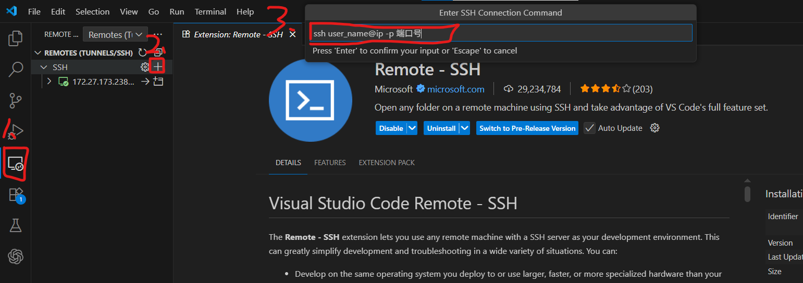

# Procedure: Connect to Server via VS Code Remote SSH

This guide explains how to use Visual Studio Code (VS Code) to connect to a remote server via SSH.

---

# Graphical interface

## 1. remote_ssh_install

## 2. remote

- Select the first save path

## 3. Next
- Type your password
- Open Folder


---

# Command

## 1. Install Requirements
- Install **Visual Studio Code** on your local machine: [Download VS Code](https://code.visualstudio.com/)
- Install the VS Code extension: **Remote - SSH**

---

## 2. Configure SSH
1. Open the SSH configuration file:
   - On Linux / macOS: `~/.ssh/config`
   - On Windows: `C:\Users\<username>\.ssh\config`

2. Add your server information:
   ```ssh
   Host myserver
     HostName <server_ip>
     User <username>
     Port 22
   ```

3. (Optional) If you use password login, you will be asked each time.
   If using a private key, add:

   ```ssh
     IdentityFile ~/.ssh/id_rsa
   ```

---

## 3. Connect from VS Code

1. Open VS Code.
2. Press **F1** (or `Ctrl+Shift+P`).
3. Type and select **Remote-SSH: Connect to Host...**.
4. Choose the configured host.
5. Enter your password (if required).

---

## 4. Open Remote Workspace

* After connecting, VS Code will reload in **remote mode**.
* You can now open files, edit code, and run terminals directly on the server.

---

## 5. Useful Tips

* **Open Remote Terminal**: \`Ctrl+Shift+\`\` → it will run commands directly on the server.
* **Install Extensions on Remote**: Some extensions need to be installed on the remote server; VS Code will prompt you automatically.
* **Disconnect**: Use **F1 → Remote-SSH: Close Remote Connection**.

---
